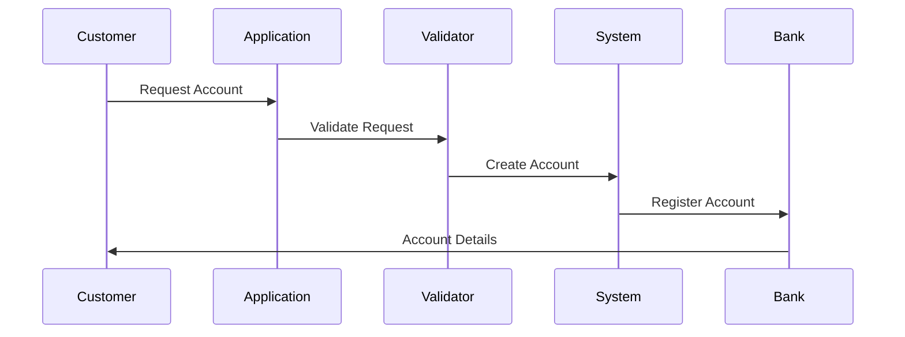
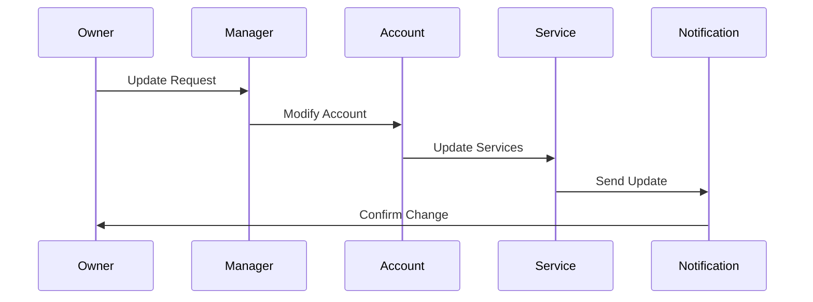

# Account Structures Implementation

This document covers the implementation details and technical specifications for account structures in fintech applications..

## Overview

Account structures form the foundation of financial services, defining how accounts are organized, managed, and operated within a fintech application. This document explains the core concepts, hierarchies, and implementation details for managing account structures in a fintech application.

## Core Concepts

### Account Types

#### 1. Consumer Accounts
- **Personal Accounts**
  - Checking accounts
  - Savings accounts
  - Investment accounts
  - Retirement accounts

- **Specialized Accounts**
  - Student accounts
  - Senior accounts
  - Youth accounts
  - Joint accounts

- **Digital Accounts**
  - E-wallets
  - Digital savings
  - Micro-investment
  - Goal-based accounts

#### 2. Business Accounts
- **Commercial Accounts**
  - Business checking
  - Business savings
  - Merchant accounts
  - Treasury accounts

- **Corporate Accounts**
  - Corporate accounts
  - Subsidiary accounts
  - Department accounts
  - Project accounts

- **Special Purpose**
  - Escrow accounts
  - Trust accounts
  - Custody accounts
  - Settlement accounts

#### 3. Financial Institution Accounts
- **Bank Accounts**
  - Correspondent accounts
  - Nostro accounts
  - Vostro accounts
  - Settlement accounts

- **Investment Accounts**
  - Brokerage accounts
  - Custody accounts
  - Fund accounts
  - Trading accounts

- **Special Accounts**
  - Clearing accounts
  - Reserve accounts
  - Settlement accounts
  - System accounts

### Account Hierarchy

#### 1. Account Relationships
- **Primary Accounts**
  - Main account
  - Parent account
  - Master account
  - Control account

- **Sub-Accounts**
  - Linked accounts
  - Child accounts
  - Sub-accounts
  - Dependent accounts

- **Related Accounts**
  - Joint accounts
  - Beneficiary accounts
  - Power of attorney
  - Trust accounts

#### 2. Account Management
- **Access Control**
  - Account owners
  - Authorized users
  - Delegated access
  - Role-based access

- **Account Operations**
  - Account opening
  - Account maintenance
  - Account closure
  - Account conversion

- **Account Services**
  - Transaction limits
  - Interest rates
  - Fee structures
  - Service packages

### Account Flows

#### 1. Account Creation Flow


#### 2. Account Management Flow


## Implementation Guidelines

### 1. Account Management System

#### Account Structure
```go
// AccountManager handles account operations
type AccountManager struct {
    creator         AccountCreator
    validator       AccountValidator
    serviceManager  ServiceManager
    eventManager    EventManager
}

// Account represents a financial account
type Account struct {
    ID              string
    Type            AccountType
    Owner           AccountOwner
    Status          AccountStatus
    Balance         decimal.Decimal
    Currency        string
    CreatedAt       time.Time
    UpdatedAt       time.Time
}

// AccountOwner represents an account owner
type AccountOwner struct {
    ID              string
    Type            OwnerType
    Details         OwnerDetails
    Permissions     []Permission
    Status          OwnerStatus
}

func (am *AccountManager) CreateAccount(
    ctx context.Context,
    request *AccountRequest,
) (*Account, error) {
    // Validate request
    // Create account
    // Setup services
    // Generate events
}
```

#### Account Services
```go
// ServiceManager handles account services
type ServiceManager struct {
    services        map[string]Service
    provider        ServiceProvider
    monitor         ServiceMonitor
    reporter        ServiceReporter
}

// Service represents an account service
type Service struct {
    ID              string
    Type            ServiceType
    AccountID       string
    Configuration   map[string]interface{}
    Status          ServiceStatus
    LastUpdated     time.Time
}

func (sm *ServiceManager) ManageServices(
    ctx context.Context,
    account *Account,
) (*ServiceUpdate, error) {
    // Evaluate services
    // Update configuration
    // Monitor status
    // Generate reports
}
```

### 2. Account Hierarchy System

#### Hierarchy Management
```go
// HierarchyManager handles account relationships
type HierarchyManager struct {
    relationships   map[string]Relationship
    validator       RelationshipValidator
    monitor         RelationshipMonitor
    reporter        RelationshipReporter
}

// Relationship represents account relationships
type Relationship struct {
    ID              string
    Type            RelationshipType
    ParentAccount   string
    ChildAccount    string
    Permissions     []Permission
    Status          RelationshipStatus
}

func (hm *HierarchyManager) ManageRelationship(
    ctx context.Context,
    relationship *Relationship,
) (*RelationshipUpdate, error) {
    // Validate relationship
    // Update hierarchy
    // Monitor changes
    // Generate events
}
```

## Best Practices

### 1. Account Management
- Clear structure
- Proper validation
- Secure operations
- Audit trails
- Documentation

### 2. Account Services
- Service isolation
- Clear interfaces
- Performance monitoring
- Error handling
- Service recovery

### 3. Account Hierarchy
- Clear relationships
- Access control
- Hierarchy validation
- Change management
- Audit logging

### 4. Operations
- Clear procedures
- Automation
- Monitoring
- Support
- Recovery

## Common Pitfalls

1. **Account Structure**
   - Complex hierarchies
   - Unclear relationships
   - Solution: Clear design

2. **Account Services**
   - Service conflicts
   - Performance issues
   - Solution: Service isolation

3. **Account Management**
   - Access issues
   - Validation gaps
   - Solution: Strong controls

4. **Operations**
   - Process gaps
   - Manual errors
   - Solution: Automation

## Monitoring and Alerts

### Key Metrics
- Account creation
- Service usage
- Hierarchy changes
- Access patterns
- Performance metrics

### Alerts
- Account issues
- Service failures
- Access violations
- Performance problems
- System issues

## Testing

### Unit Tests
```go
func TestAccountCreation(t *testing.T) {
    tests := []struct {
        name    string
        request *AccountRequest
        want    *Account
    }{
        {
            name: "create personal checking account",
            request: &AccountRequest{
                Type:     AccountTypePersonalChecking,
                Owner:    &AccountOwner{Type: OwnerTypeIndividual},
                Currency: "USD",
            },
            want: &Account{
                Type:     AccountTypePersonalChecking,
                Status:   AccountStatusActive,
                Currency: "USD",
            },
        },
        // Add more test cases
    }
    
    for _, tt := range tests {
        t.Run(tt.name, func(t *testing.T) {
            // Test account creation
        })
    }
}
```

### Integration Tests
- End-to-end flows
- Account operations
- Service management
- Hierarchy changes
- Access control

## Resources

### Internal Resources
- [API Documentation](./../../../api/README.md)
- [Compliance Guide](./../../compliance/README.md)
- [Security Guide](./../../security/README.md)

### External Resources
- [Banking Standards](https://www.iso20022.org/)
- [Account Standards](https://www.aba.com/)
- [Financial Standards](https://www.financialstandardsboard.org/)