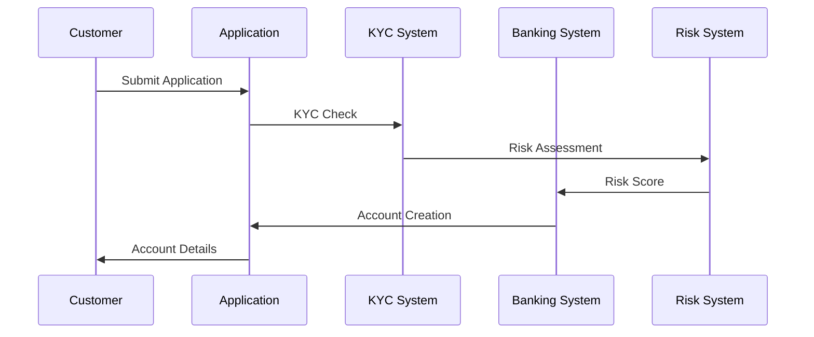
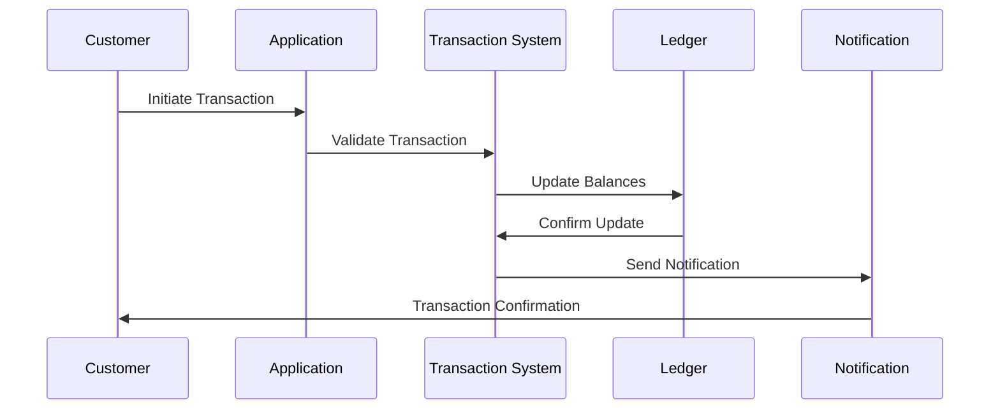

# Banking Operations Implementation

This document covers the implementation details and technical specifications for banking operations in fintech applications..

## Overview

Banking operations form the foundation of financial services, encompassing account management, transaction processing, and financial record-keeping. This document explains the core concepts, operations, and considerations for implementing banking functionality in a fintech application.

## Core Concepts

### Account Types

#### 1. Deposit Accounts
- **Checking Accounts**
  - Daily transactions
  - No interest (typically)
  - Overdraft protection
  - Direct deposit support

- **Savings Accounts**
  - Interest-bearing
  - Transaction limits
  - Minimum balance requirements
  - Higher interest rates

- **Money Market Accounts**
  - Higher interest rates
  - Limited transactions
  - Higher minimum balance
  - Tiered interest rates

#### 2. Specialized Accounts
- **Business Accounts**
  - Multiple signatories
  - Business-specific features
  - Higher transaction limits
  - Business reporting

- **Joint Accounts**
  - Multiple owners
  - Shared access
  - Survivorship rights
  - Combined limits

### Banking Operations

#### 1. Account Management
- Account opening
- Account maintenance
- Account closure
- Account restrictions
- Account verification

#### 2. Transaction Processing
- Deposits
- Withdrawals
- Transfers
- Standing orders
- Recurring payments

#### 3. Interest Operations
- Interest calculation
- Interest posting
- Rate changes
- Interest reporting
- Tax reporting

### Banking Flows

#### 1. Account Opening Flow


#### 2. Transaction Processing Flow


## Implementation Guidelines

### 1. Core Banking System

#### Account Management
```go
// Account represents a banking account
type Account struct {
    ID              string
    Type            AccountType
    Status          AccountStatus
    Balance         decimal.Decimal
    Currency        string
    Owner           []AccountOwner
    Restrictions    []AccountRestriction
    InterestRate    decimal.Decimal
    CreatedAt       time.Time
    UpdatedAt       time.Time
}

// AccountManager handles account operations
type AccountManager interface {
    CreateAccount(ctx context.Context, account *Account) error
    UpdateAccount(ctx context.Context, account *Account) error
    CloseAccount(ctx context.Context, accountID string) error
    GetAccount(ctx context.Context, accountID string) (*Account, error)
    ListAccounts(ctx context.Context, ownerID string) ([]*Account, error)
}
```

#### Transaction Processing
```go
// Transaction represents a banking transaction
type Transaction struct {
    ID              string
    Type            TransactionType
    Status          TransactionStatus
    Amount          decimal.Decimal
    Currency        string
    SourceAccount   string
    TargetAccount   string
    Description     string
    Metadata        map[string]interface{}
    CreatedAt       time.Time
    ProcessedAt     time.Time
}

// TransactionProcessor handles transaction operations
type TransactionProcessor interface {
    ProcessTransaction(ctx context.Context, tx *Transaction) error
    ReverseTransaction(ctx context.Context, txID string) error
    GetTransaction(ctx context.Context, txID string) (*Transaction, error)
    ListTransactions(ctx context.Context, accountID string) ([]*Transaction, error)
}
```

### 2. Interest Management

#### Interest Calculation
```go
// InterestCalculator handles interest calculations
type InterestCalculator struct {
    baseRate        decimal.Decimal
    tierRates       map[decimal.Decimal]decimal.Decimal
    compoundingFreq time.Duration
}

func (ic *InterestCalculator) CalculateInterest(
    ctx context.Context,
    balance decimal.Decimal,
    period time.Duration,
) (decimal.Decimal, error) {
    // Calculate applicable rate
    // Apply compounding
    // Handle tiered rates
    // Return interest amount
}

// InterestPosting handles interest posting to accounts
type InterestPosting struct {
    AccountID       string
    Period          time.Time
    Amount          decimal.Decimal
    TaxAmount       decimal.Decimal
    Status          PostingStatus
}
```

### 3. Account Restrictions

#### Restriction Management
```go
// AccountRestriction represents account limitations
type AccountRestriction struct {
    Type            RestrictionType
    Value           interface{}
    StartDate       time.Time
    EndDate         time.Time
    Reason          string
}

// RestrictionManager handles account restrictions
type RestrictionManager interface {
    AddRestriction(ctx context.Context, accountID string, restriction *AccountRestriction) error
    RemoveRestriction(ctx context.Context, accountID string, restrictionID string) error
    CheckRestrictions(ctx context.Context, accountID string, operation OperationType) error
}
```

## Best Practices

### 1. Account Management
- Implement proper KYC/AML checks
- Maintain audit trails
- Handle account status changes
- Implement proper authorization
- Regular account reviews

### 2. Transaction Processing
- Use database transactions
- Implement proper validation
- Handle concurrent transactions
- Maintain transaction logs
- Implement proper rollback

### 3. Interest Operations
- Accurate interest calculations
- Proper rate management
- Tax compliance
- Regular interest posting
- Interest reporting

### 4. Security
- Role-based access control
- Transaction limits
- Fraud detection
- Audit logging
- Regular security reviews

## Common Pitfalls

1. **Balance Management**
   - Race conditions
   - Incorrect balance updates
   - Solution: Use proper locking and transactions

2. **Interest Calculation**
   - Incorrect rate application
   - Timing issues
   - Solution: Implement proper interest calculation system

3. **Account Restrictions**
   - Missing restriction checks
   - Incorrect restriction application
   - Solution: Implement comprehensive restriction system

4. **Transaction Processing**
   - Duplicate transactions
   - Incomplete transactions
   - Solution: Use proper transaction management

## Monitoring and Alerts

### Key Metrics
- Account creation rate
- Transaction volume
- Interest accrual
- Error rates
- Processing times

### Alerts
- High-value transactions
- Unusual account activity
- Failed transactions
- System issues
- Compliance violations

## Testing

### Unit Tests
```go
func TestAccountOperations(t *testing.T) {
    tests := []struct {
        name    string
        account *Account
        want    error
    }{
        {
            name: "valid account creation",
            account: &Account{
                Type:     AccountTypeSavings,
                Currency: "USD",
                Owner:    []AccountOwner{{ID: "user123"}},
            },
            want: nil,
        },
        // Add more test cases
    }
    
    for _, tt := range tests {
        t.Run(tt.name, func(t *testing.T) {
            // Test account operations
        })
    }
}
```

### Integration Tests
- End-to-end account flows
- Transaction processing
- Interest calculations
- Restriction management
- Security tests

## Resources

### Internal Resources
- [API Documentation](./../../../api/README.md)
- [Security Guide](./../../security/README.md)
- [Compliance Guide](./../../compliance/README.md)

### External Resources
- [Banking Regulations](https://www.federalreserve.gov/)
- [ISO 20022](https://www.iso20022.org/)
- [SWIFT Standards](https://www.swift.com/standards)
