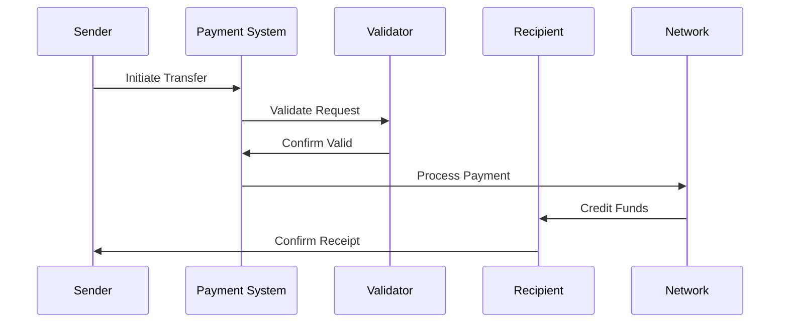
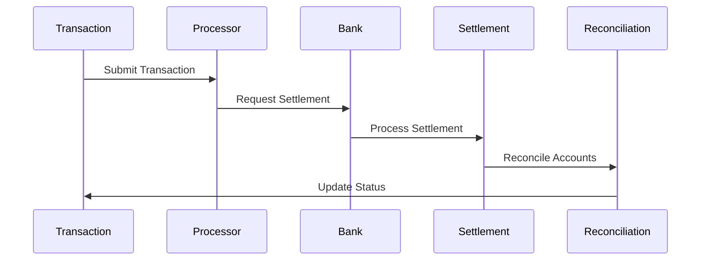

# Money Movement Implementation

This document covers the implementation details and technical specifications for money movement in fintech applications.

## Overview

Money movement is a core component of fintech applications, encompassing the processes and systems that enable the secure and efficient transfer of funds between accounts, institutions, and payment networks. This document explains the core concepts, flows, and implementation details for handling money movement in a fintech application.

## Core Concepts

### Payment Types

#### 1. Direct Transfers
- **Internal Transfers**
  - Account-to-account
  - User-to-user
  - Business-to-business
  - Scheduled transfers

- **External Transfers**
  - Bank transfers
  - Wire transfers
  - ACH transfers
  - International remittances

- **Payment Networks**
  - SWIFT
  - ACH
  - SEPA
  - Local payment schemes

#### 2. Card Payments
- **Card Types**
  - Credit cards
  - Debit cards
  - Prepaid cards
  - Virtual cards

- **Payment Methods**
  - Card-present
  - Card-not-present
  - Contactless
  - Digital wallets

- **Processing Networks**
  - Visa
  - Mastercard
  - American Express
  - Local networks

#### 3. Digital Payments
- **Mobile Payments**
  - P2P transfers
  - QR payments
  - NFC payments
  - In-app payments

- **Digital Wallets**
  - E-wallets
  - Mobile wallets
  - Cryptocurrency wallets
  - Loyalty wallets

- **Alternative Methods**
  - QR codes
  - Payment links
  - Instant payments
  - Cryptocurrency

### Money Movement Flows

#### 1. Transfer Flow


#### 2. Settlement Flow


## Implementation Guidelines

### 1. Payment Processing System

#### Transfer Processing
```go
// TransferProcessor handles money movement
type TransferProcessor struct {
    validator       TransferValidator
    router          PaymentRouter
    settlement      SettlementManager
    reconciliation  ReconciliationManager
}

// Transfer represents a money movement
type Transfer struct {
    ID              string
    Type            TransferType
    Amount          decimal.Decimal
    Currency        string
    Source          Account
    Destination     Account
    Status          TransferStatus
    CreatedAt       time.Time
    UpdatedAt       time.Time
}

// Settlement represents a payment settlement
type Settlement struct {
    ID              string
    TransferID      string
    Amount          decimal.Decimal
    Currency        string
    Status          SettlementStatus
    Network         PaymentNetwork
    SettledAt       time.Time
}

func (tp *TransferProcessor) ProcessTransfer(
    ctx context.Context,
    transfer *Transfer,
) (*TransferResult, error) {
    // Validate transfer
    // Route payment
    // Process settlement
    // Reconcile accounts
}
```

#### Payment Routing
```go
// PaymentRouter handles payment routing
type PaymentRouter struct {
    networks        map[string]PaymentNetwork
    rules           []RoutingRule
    optimizer       RouteOptimizer
    monitor         RouteMonitor
}

// PaymentRoute represents a payment path
type PaymentRoute struct {
    ID              string
    TransferID      string
    Network         PaymentNetwork
    Cost            decimal.Decimal
    Duration        time.Duration
    Priority        int
    Status          RouteStatus
}

func (pr *PaymentRouter) RoutePayment(
    ctx context.Context,
    transfer *Transfer,
) (*PaymentRoute, error) {
    // Evaluate routes
    // Select optimal path
    // Reserve capacity
    // Execute routing
}
```

### 2. Settlement System

#### Settlement Management
```go
// SettlementManager handles payment settlements
type SettlementManager struct {
    processor       SettlementProcessor
    validator       SettlementValidator
    reconciler      SettlementReconciler
    reporter        SettlementReporter
}

// SettlementBatch represents a settlement batch
type SettlementBatch struct {
    ID              string
    Date            time.Time
    Transactions    []Transfer
    TotalAmount     decimal.Decimal
    Currency        string
    Status          BatchStatus
    ProcessedAt     time.Time
}

func (sm *SettlementManager) ProcessSettlement(
    ctx context.Context,
    batch *SettlementBatch,
) (*SettlementResult, error) {
    // Process batch
    // Validate settlements
    // Reconcile accounts
    // Generate reports
}
```

## Best Practices

### 1. Payment Processing
- Secure processing
- Efficient routing
- Cost optimization
- Speed optimization
- Error handling

### 2. Settlement
- Timely settlement
- Accurate reconciliation
- Clear reporting
- Error recovery
- Audit trails

### 3. Risk Management
- Fraud prevention
- Compliance checks
- Limit management
- Monitoring
- Reporting

### 4. Operations
- Clear procedures
- Documentation
- Monitoring
- Support
- Recovery

## Common Pitfalls

1. **Payment Processing**
   - Routing errors
   - Settlement delays
   - Solution: Robust routing and settlement

2. **Risk Management**
   - Fraud exposure
   - Compliance issues
   - Solution: Strong controls

3. **Operations**
   - Process gaps
   - Manual errors
   - Solution: Automation and checks

4. **Settlement**
   - Reconciliation issues
   - Reporting delays
   - Solution: Automated reconciliation

## Monitoring and Alerts

### Key Metrics
- Transaction volume
- Settlement times
- Success rates
- Error rates
- Processing costs

### Alerts
- Failed transfers
- Settlement delays
- High error rates
- Compliance issues
- System issues

## Testing

### Unit Tests
```go
func TestTransferProcessing(t *testing.T) {
    tests := []struct {
        name      string
        transfer  *Transfer
        want      *TransferResult
    }{
        {
            name: "successful internal transfer",
            transfer: &Transfer{
                Type:     TransferTypeInternal,
                Amount:   decimal.NewFromFloat(100.00),
                Currency: "USD",
            },
            want: &TransferResult{
                Status: TransferStatusCompleted,
                Error:  nil,
            },
        },
        // Add more test cases
    }
    
    for _, tt := range tests {
        t.Run(tt.name, func(t *testing.T) {
            // Test transfer processing
        })
    }
}
```

### Integration Tests
- End-to-end transfers
- Settlement flows
- Reconciliation
- Error handling
- Recovery procedures

## Resources

### Internal Resources
- [API Documentation](./../../api/README.md)
- [Compliance Guide](./../compliance/README.md)
- [Security Guide](./../security/README.md)

### External Resources
- [SWIFT Documentation](https://www.swift.com/)
- [ACH Network](https://www.nacha.org/)
- [SEPA Documentation](https://www.europeanpaymentscouncil.eu/) 