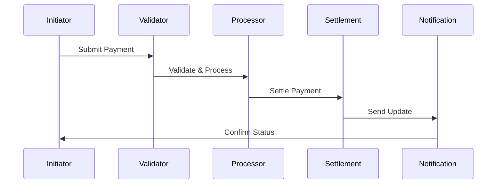

# Transaction Types Implementation

This document covers the implementation details and technical specifications for transaction types in fintech applications.

## Overview

Transaction types define the various ways in which financial transactions are processed, categorized, and managed within a fintech application. This document explains the core concepts, categories, and implementation details for handling different types of transactions in a fintech application.

## Core Concepts

### Transaction Categories

#### 1. Payment Transactions
- **Direct Payments**
  - Account transfers
  - Bill payments
  - P2P transfers
  - Merchant payments

- **Card Payments**
  - Credit card
  - Debit card
  - Prepaid card
  - Virtual card

- **Digital Payments**
  - Mobile payments
  - QR payments
  - Digital wallet
  - Cryptocurrency

#### 2. Banking Transactions
- **Deposit Transactions**
  - Cash deposits
  - Check deposits
  - Electronic deposits
  - Interest deposits

- **Withdrawal Transactions**
  - Cash withdrawals
  - ATM withdrawals
  - Electronic withdrawals
  - Fee withdrawals

- **Account Transactions**
  - Balance inquiries
  - Statement requests
  - Account updates
  - Service charges

#### 3. Special Transactions
- **Scheduled Transactions**
  - Recurring payments
  - Standing orders
  - Future-dated
  - Conditional

- **Batch Transactions**
  - Bulk payments
  - Batch transfers
  - Mass updates
  - System batches

- **System Transactions**
  - Interest calculations
  - Fee assessments
  - Account maintenance
  - System adjustments

### Transaction Processing

#### 1. Processing Types
- **Real-time Processing**
  - Instant payments
  - Immediate settlement
  - Real-time updates
  - Live processing

- **Batch Processing**
  - End-of-day
  - Scheduled batches
  - Bulk processing
  - System batches

- **Scheduled Processing**
  - Future-dated
  - Recurring
  - Conditional
  - Delayed

#### 2. Transaction States
- **Initiation**
  - Created
  - Validated
  - Authorized
  - Submitted

- **Processing**
  - In progress
  - Pending
  - Queued
  - Processing

- **Completion**
  - Completed
  - Failed
  - Reversed
  - Cancelled

### Transaction Flows

#### 1. Payment Flow


#### 2. Batch Flow


## Implementation Guidelines

### 1. Transaction Processing System

#### Transaction Management
```go
// TransactionManager handles transaction processing
type TransactionManager struct {
    validator       TransactionValidator
    processor       TransactionProcessor
    settlement      SettlementManager
    notification    NotificationManager
}

// Transaction represents a financial transaction
type Transaction struct {
    ID              string
    Type            TransactionType
    Amount          decimal.Decimal
    Currency        string
    Source          Account
    Destination     Account
    Status          TransactionStatus
    CreatedAt       time.Time
    UpdatedAt       time.Time
}

// TransactionBatch represents a batch of transactions
type TransactionBatch struct {
    ID              string
    Type            BatchType
    Transactions    []Transaction
    Status          BatchStatus
    ProcessedAt     time.Time
}

func (tm *TransactionManager) ProcessTransaction(
    ctx context.Context,
    transaction *Transaction,
) (*TransactionResult, error) {
    // Validate transaction
    // Process payment
    // Handle settlement
    // Send notifications
}
```

#### Transaction Processing
```go
// TransactionProcessor handles transaction execution
type TransactionProcessor struct {
    executor        TransactionExecutor
    validator       TransactionValidator
    monitor         TransactionMonitor
    reporter        TransactionReporter
}

// ProcessingResult represents transaction processing result
type ProcessingResult struct {
    TransactionID   string
    Status          ProcessingStatus
    Error           error
    Details         map[string]interface{}
    ProcessedAt     time.Time
}

func (tp *TransactionProcessor) ExecuteTransaction(
    ctx context.Context,
    transaction *Transaction,
) (*ProcessingResult, error) {
    // Execute transaction
    // Validate result
    // Monitor status
    // Generate report
}
```

### 2. Transaction Monitoring System

#### Transaction Monitoring
```go
// TransactionMonitor handles transaction monitoring
type TransactionMonitor struct {
    metrics         map[string]Metric
    alerts          []Alert
    analyzer        TransactionAnalyzer
    reporter        MonitorReporter
}

// TransactionMetric represents a transaction metric
type TransactionMetric struct {
    ID              string
    Type            MetricType
    Value           float64
    Threshold       float64
    Trend           []float64
    LastUpdated     time.Time
}

func (tm *TransactionMonitor) MonitorTransaction(
    ctx context.Context,
    transaction *Transaction,
) (*MonitoringResult, error) {
    // Collect metrics
    // Analyze patterns
    // Generate alerts
    // Update status
}
```

## Best Practices

### 1. Transaction Processing
- Clear validation
- Proper authorization
- Secure processing
- Error handling
- Audit trails

### 2. Transaction Management
- Clear categorization
- Proper routing
- Status tracking
- Error recovery
- Documentation

### 3. Transaction Monitoring
- Real-time monitoring
- Pattern analysis
- Alert management
- Performance tracking
- Reporting

### 4. Operations
- Clear procedures
- Automation
- Monitoring
- Support
- Recovery

## Common Pitfalls

1. **Transaction Processing**
   - Validation gaps
   - Authorization issues
   - Solution: Strong controls

2. **Transaction Management**
   - Status tracking
   - Error handling
   - Solution: Robust management

3. **Transaction Monitoring**
   - Missed alerts
   - Delayed response
   - Solution: Active monitoring

4. **Operations**
   - Process gaps
   - Manual errors
   - Solution: Automation

## Monitoring and Alerts

### Key Metrics
- Transaction volume
- Processing times
- Success rates
- Error rates
- Settlement times

### Alerts
- Failed transactions
- Processing delays
- High error rates
- Compliance issues
- System issues

## Testing

### Unit Tests
```go
func TestTransactionProcessing(t *testing.T) {
    tests := []struct {
        name         string
        transaction  *Transaction
        want         *ProcessingResult
    }{
        {
            name: "successful payment transaction",
            transaction: &Transaction{
                Type:     TransactionTypePayment,
                Amount:   decimal.NewFromFloat(100.00),
                Currency: "USD",
            },
            want: &ProcessingResult{
                Status: ProcessingStatusCompleted,
                Error:  nil,
            },
        },
        // Add more test cases
    }
    
    for _, tt := range tests {
        t.Run(tt.name, func(t *testing.T) {
            // Test transaction processing
        })
    }
}
```

### Integration Tests
- End-to-end flows
- Transaction processing
- Batch processing
- Error handling
- Recovery procedures

## Resources

### Internal Resources
- [API Documentation](./../../api/README.md)
- [Compliance Guide](./../compliance/README.md)
- [Security Guide](./../security/README.md)

### External Resources
- [ISO 20022](https://www.iso20022.org/)
- [Payment Standards](https://www.nacha.org/)
- [Transaction Standards](https://www.swift.com/) 