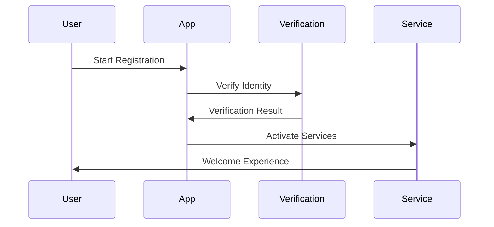
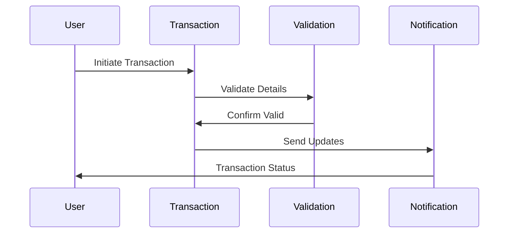

# Customer Experience Implementation

This document covers the implementation details and technical specifications for customer experience in fintech applications.

## Overview

Customer experience (CX) is a critical component of fintech applications, encompassing all aspects of user interaction, from onboarding to ongoing service delivery. This document explains the core concepts, principles, and implementation strategies for delivering exceptional customer experiences in a fintech application.

## Core Concepts

### Customer Journey

#### 1. Onboarding Experience
- **Account Creation**
  - Simple registration
  - Identity verification
  - Document upload
  - Initial funding

- **First-Time User Experience**
  - Welcome flow
  - Feature discovery
  - Guided setup
  - Success confirmation

- **Compliance & Verification**
  - KYC process
  - AML checks
  - Risk assessment
  - Account activation

#### 2. Service Delivery
- **Transaction Experience**
  - Payment flows
  - Transfer processes
  - Transaction status
  - Receipt generation

- **Account Management**
  - Balance viewing
  - Statement access
  - Settings management
  - Profile updates

- **Support & Assistance**
  - Help center
  - Chat support
  - FAQ access
  - Issue resolution

#### 3. Engagement & Retention
- **Communication**
  - Notifications
  - Alerts
  - Updates
  - Marketing messages

- **Value-Added Services**
  - Financial insights
  - Budgeting tools
  - Savings goals
  - Investment options

- **Feedback & Improvement**
  - User surveys
  - Feature requests
  - Bug reporting
  - Satisfaction tracking

### Experience Design Principles

#### 1. User Interface
- **Accessibility**
  - WCAG compliance
  - Screen reader support
  - Color contrast
  - Keyboard navigation

- **Responsiveness**
  - Mobile-first design
  - Cross-device compatibility
  - Performance optimization
  - Load time management

- **Visual Design**
  - Brand consistency
  - Clear typography
  - Intuitive icons
  - Visual hierarchy

#### 2. Interaction Design
- **Usability**
  - Intuitive navigation
  - Clear actions
  - Consistent patterns
  - Error prevention

- **Feedback**
  - Action confirmation
  - Status updates
  - Error messages
  - Success indicators

- **Personalization**
  - User preferences
  - Customizable features
  - Adaptive content
  - Contextual help

### Experience Flows

#### 1. Onboarding Flow


#### 2. Transaction Flow


## Implementation Guidelines

### 1. Experience Management System

#### User Journey Management
```go
// JourneyManager handles user experience flows
type JourneyManager struct {
    flowEngine      FlowEngine
    stateManager    StateManager
    eventTracker    EventTracker
    analytics       Analytics
}

// UserJourney represents a user's experience flow
type UserJourney struct {
    UserID          string
    Stage           JourneyStage
    Progress        float64
    Milestones      []Milestone
    Interactions    []Interaction
    LastUpdated     time.Time
}

// Interaction represents a user interaction
type Interaction struct {
    ID              string
    Type            InteractionType
    Context         map[string]interface{}
    Outcome         InteractionOutcome
    Timestamp       time.Time
    Duration        time.Duration
}

func (jm *JourneyManager) TrackJourney(
    ctx context.Context,
    journey *UserJourney,
) (*JourneyUpdate, error) {
    // Track progress
    // Update milestones
    // Record interactions
    // Generate insights
}
```

#### Experience Analytics
```go
// ExperienceAnalytics handles CX metrics
type ExperienceAnalytics struct {
    metrics         map[string]Metric
    aggregator      MetricAggregator
    reporter        ReportGenerator
    optimizer       ExperienceOptimizer
}

// ExperienceMetric represents a CX metric
type ExperienceMetric struct {
    ID              string
    Name            string
    Type            MetricType
    Value           float64
    Threshold       float64
    Trend           []float64
    LastUpdated     time.Time
}

func (ea *ExperienceAnalytics) AnalyzeExperience(
    ctx context.Context,
    period time.Time,
) (*ExperienceReport, error) {
    // Collect metrics
    // Analyze trends
    // Generate insights
    // Make recommendations
}
```

### 2. Feedback System

#### Feedback Management
```go
// FeedbackManager handles user feedback
type FeedbackManager struct {
    collector       FeedbackCollector
    analyzer        FeedbackAnalyzer
    responder       FeedbackResponder
    tracker         FeedbackTracker
}

// Feedback represents user feedback
type Feedback struct {
    ID              string
    Type            FeedbackType
    Category        FeedbackCategory
    Content         string
    Sentiment       float64
    Priority        Priority
    Status          FeedbackStatus
    CreatedAt       time.Time
}

func (fm *FeedbackManager) ProcessFeedback(
    ctx context.Context,
    feedback *Feedback,
) (*FeedbackResponse, error) {
    // Analyze feedback
    // Determine priority
    // Generate response
    // Track resolution
}
```

## Best Practices

### 1. User Experience
- Clear navigation
- Consistent design
- Responsive interface
- Accessible features
- Performance optimization

### 2. Service Delivery
- Reliable transactions
- Clear communication
- Quick resolution
- Proactive support
- Continuous improvement

### 3. Customer Support
- Multiple channels
- Quick response
- Knowledge base
- Self-service options
- Issue tracking

### 4. Experience Monitoring
- Regular feedback
- Usage analytics
- Performance metrics
- Satisfaction surveys
- Improvement tracking

## Common Pitfalls

1. **User Interface**
   - Complex navigation
   - Inconsistent design
   - Solution: User-centered design

2. **Service Delivery**
   - Slow response
   - Unclear processes
   - Solution: Streamlined workflows

3. **Support**
   - Limited channels
   - Delayed response
   - Solution: Multi-channel support

4. **Feedback**
   - Ignored feedback
   - No follow-up
   - Solution: Active feedback management

## Monitoring and Alerts

### Key Metrics
- User satisfaction
- Task completion
- Response times
- Error rates
- Support resolution

### Alerts
- High error rates
- Slow response
- User complaints
- Service issues
- Performance problems

## Testing

### User Testing
```go
func TestUserJourney(t *testing.T) {
    tests := []struct {
        name    string
        journey *UserJourney
        want    *JourneyUpdate
    }{
        {
            name: "successful onboarding",
            journey: &UserJourney{
                Stage:    JourneyStageOnboarding,
                Progress: 0.0,
            },
            want: &JourneyUpdate{
                Progress: 1.0,
                Status:   JourneyStatusComplete,
            },
        },
        // Add more test cases
    }
    
    for _, tt := range tests {
        t.Run(tt.name, func(t *testing.T) {
            // Test user journey
        })
    }
}
```

### Integration Tests
- End-to-end flows
- User interactions
- Service delivery
- Support processes
- Feedback handling

## Resources

### Internal Resources
- [API Documentation](./../../api/README.md)
- [UI/UX Guidelines](./../design/README.md)
- [Support Guide](./../support/README.md)

### External Resources
- [Nielsen Norman Group](https://www.nngroup.com/)
- [Google Material Design](https://material.io/)
- [Apple Human Interface Guidelines](https://developer.apple.com/design/) 