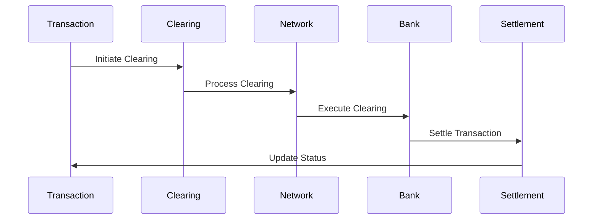
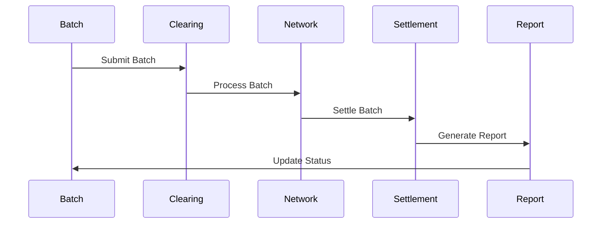

# Clearing Systems Implementation

This document covers the implementation details and technical specifications for clearing systems.

## Overview

Clearing systems are essential components of fintech applications, facilitating the exchange and settlement of financial transactions between institutions. This document explains the core concepts, processes, and implementation details for managing clearing systems in a fintech application.

## Core Concepts

### Clearing Types

#### 1. Payment Clearing
- **Direct Clearing**
  - Real-time clearing
  - Immediate clearing
  - Instant clearing
  - Same-day clearing

- **Batch Clearing**
  - End-of-day clearing
  - Scheduled clearing
  - Bulk clearing
  - System clearing

- **Network Clearing**
  - Card network clearing
  - Payment network clearing
  - Exchange clearing
  - Platform clearing

#### 2. Banking Clearing
- **Interbank Clearing**
  - Bank-to-bank clearing
  - Clearing house clearing
  - Correspondent clearing
  - Central bank clearing

- **Cross-Border Clearing**
  - International clearing
  - Currency clearing
  - Correspondent clearing
  - SWIFT clearing

- **Special Clearing**
  - Securities clearing
  - Trading clearing
  - Fund clearing
  - Derivative clearing

### Clearing Processes

#### 1. Clearing Cycles
- **Real-time Clearing**
  - Instant processing
  - Immediate confirmation
  - Real-time updates
  - Live monitoring

- **Batch Clearing**
  - Daily cycles
  - Multi-day cycles
  - End-of-period
  - Scheduled cycles

- **Conditional Clearing**
  - Time-based
  - Event-based
  - Threshold-based
  - Approval-based

#### 2. Clearing States
- **Initiation**
  - Created
  - Validated
  - Authorized
  - Submitted

- **Processing**
  - In progress
  - Pending
  - Queued
  - Processing

- **Completion**
  - Completed
  - Failed
  - Reversed
  - Cancelled

### Clearing Flows

#### 1. Standard Clearing Flow


#### 2. Batch Clearing Flow


## Implementation Guidelines

### 1. Clearing Processing System

#### Clearing Management
```go
// ClearingManager handles clearing processing
type ClearingManager struct {
    processor       ClearingProcessor
    validator       ClearingValidator
    network         ClearingNetwork
    reporter        ClearingReporter
}

// Clearing represents a clearing process
type Clearing struct {
    ID              string
    Type            ClearingType
    Amount          decimal.Decimal
    Currency        string
    Status          ClearingStatus
    BatchID         string
    CreatedAt       time.Time
    UpdatedAt       time.Time
}

// ClearingBatch represents a batch of clearings
type ClearingBatch struct {
    ID              string
    Type            BatchType
    Clearings       []Clearing
    Status          BatchStatus
    ProcessedAt     time.Time
}

func (cm *ClearingManager) ProcessClearing(
    ctx context.Context,
    clearing *Clearing,
) (*ClearingResult, error) {
    // Validate clearing
    // Process clearing
    // Handle network
    // Generate reports
}
```

#### Clearing Processing
```go
// ClearingProcessor handles clearing execution
type ClearingProcessor struct {
    executor        ClearingExecutor
    validator       ClearingValidator
    monitor         ClearingMonitor
    reporter        ClearingReporter
}

// ProcessingResult represents clearing processing result
type ProcessingResult struct {
    ClearingID      string
    Status          ProcessingStatus
    Error           error
    Details         map[string]interface{}
    ProcessedAt     time.Time
}

func (cp *ClearingProcessor) ExecuteClearing(
    ctx context.Context,
    clearing *Clearing,
) (*ProcessingResult, error) {
    // Execute clearing
    // Validate result
    // Monitor status
    // Generate report
}
```

### 2. Clearing Monitoring System

#### Clearing Monitoring
```go
// ClearingMonitor handles clearing monitoring
type ClearingMonitor struct {
    metrics         map[string]Metric
    alerts          []Alert
    analyzer        ClearingAnalyzer
    reporter        MonitorReporter
}

// ClearingMetric represents a clearing metric
type ClearingMetric struct {
    ID              string
    Type            MetricType
    Value           float64
    Threshold       float64
    Trend           []float64
    LastUpdated     time.Time
}

func (cm *ClearingMonitor) MonitorClearing(
    ctx context.Context,
    clearing *Clearing,
) (*MonitoringResult, error) {
    // Collect metrics
    // Analyze patterns
    // Generate alerts
    // Update status
}
```

### 3. Clearing Reconciliation System

```go
// ReconciliationManager handles clearing reconciliation
type ReconciliationManager struct {
    processor       ReconciliationProcessor
    validator       ReconciliationValidator
    reporter        ReconciliationReporter
    monitor         ReconciliationMonitor
}

// Reconciliation represents a reconciliation process
type Reconciliation struct {
    ID              string
    Type            ReconciliationType
    Status          ReconciliationStatus
    Results         []ReconciliationResult
    CreatedAt       time.Time
    UpdatedAt       time.Time
}

func (rm *ReconciliationManager) ProcessReconciliation(
    ctx context.Context,
    reconciliation *Reconciliation,
) (*ReconciliationResult, error) {
    // Process reconciliation
    // Validate results
    // Generate reports
    // Monitor status
}
```

### 4. Clearing Reporting System

```go
// ReportingManager handles clearing reporting
type ReportingManager struct {
    generator       ReportGenerator
    validator       ReportValidator
    distributor     ReportDistributor
    archiver        ReportArchiver
}

// Report represents a clearing report
type Report struct {
    ID              string
    Type            ReportType
    Period          time.Time
    Content         ReportContent
    Status          ReportStatus
    CreatedAt       time.Time
}

func (rm *ReportingManager) GenerateReport(
    ctx context.Context,
    report *Report,
) (*ReportResult, error) {
    // Generate report
    // Validate content
    // Distribute report
    // Archive report
}
```

## Best Practices

### 1. Clearing Processing
- Clear validation
- Proper authorization
- Secure processing
- Error handling
- Audit trails

### 2. Clearing Management
- Clear categorization
- Proper routing
- Status tracking
- Error recovery
- Documentation

### 3. Clearing Monitoring
- Real-time monitoring
- Pattern analysis
- Alert management
- Performance tracking
- Reporting

### 4. Operations
- Clear procedures
- Automation
- Monitoring
- Support
- Recovery

## Common Pitfalls

1. **Clearing Processing**
   - Validation gaps
   - Authorization issues
   - Solution: Strong controls

2. **Clearing Management**
   - Status tracking
   - Error handling
   - Solution: Robust management

3. **Clearing Monitoring**
   - Missed alerts
   - Delayed response
   - Solution: Active monitoring

4. **Operations**
   - Process gaps
   - Manual errors
   - Solution: Automation

## Monitoring and Alerts

### Key Metrics
- Clearing volume
- Processing times
- Success rates
- Error rates
- Network performance

### Alerts
- Failed clearings
- Processing delays
- High error rates
- Network issues
- System issues

## Testing

### Unit Tests
```go
func TestClearingProcessing(t *testing.T) {
    tests := []struct {
        name      string
        clearing  *Clearing
        want      *ProcessingResult
    }{
        {
            name: "successful clearing",
            clearing: &Clearing{
                Type:     ClearingTypeDirect,
                Amount:   decimal.NewFromFloat(1000.00),
                Currency: "USD",
            },
            want: &ProcessingResult{
                Status: ProcessingStatusCompleted,
                Error:  nil,
            },
        },
        // Add more test cases
    }
    
    for _, tt := range tests {
        t.Run(tt.name, func(t *testing.T) {
            // Test clearing processing
        })
    }
}
```

### Integration Tests
- End-to-end flows
- Clearing processing
- Batch processing
- Error handling
- Recovery procedures

## Resources

### Internal Resources
- [API Documentation](./../../api/README.md)
- [Compliance Guide](./../compliance/README.md)
- [Security Guide](./../security/README.md)

### External Resources
- [ISO 20022](https://www.iso20022.org/)
- [SWIFT Documentation](https://www.swift.com/)
- [Clearing Standards](https://www.bis.org/) 