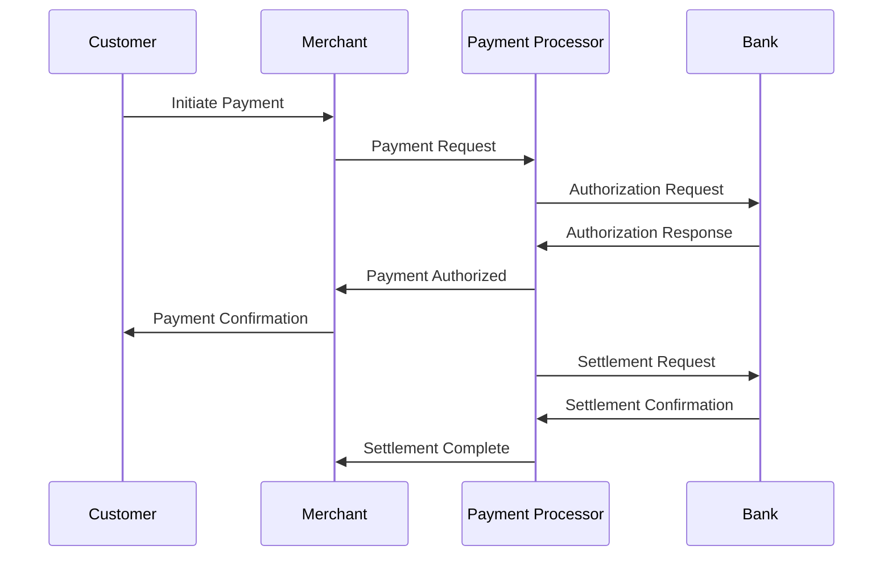
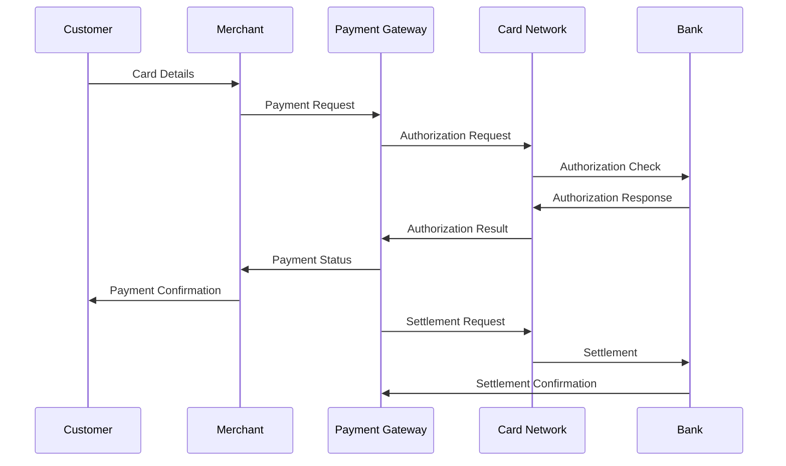

# Payment Processing Implementation

This document covers the implementation details and technical specifications for payment processing in fintech applications.

## Overview

Payment processing is the backbone of any fintech application, involving the secure and reliable transfer of funds between parties. This document explains the core concepts, flows, and considerations for implementing payment processing in a fintech application.

## Core Concepts

### Payment Types

#### 1. Direct Payments
- **Bank Transfers (ACH/SEPA)**
  - Direct account-to-account transfers
  - Batch processing
  - Settlement times: 1-3 business days
  - Lower fees, higher security

- **Wire Transfers**
  - Real-time or same-day processing
  - Higher fees
  - Irreversible once settled
  - Used for large amounts

#### 2. Card Payments
- **Credit Cards**
  - Authorization and capture
  - Chargeback risk
  - Higher fees
  - Consumer protection

- **Debit Cards**
  - Direct account deduction
  - PIN or signature based
  - Lower fees than credit
  - Faster settlement

#### 3. Digital Wallets
- **Mobile Wallets**
  - Apple Pay, Google Pay
  - Tokenized card information
  - Contactless payments
  - Enhanced security

- **E-Wallets**
  - PayPal, Venmo
  - Stored balance
  - Peer-to-peer transfers
  - Quick settlement

### Payment States

1. **Initiated**
   - Payment request created
   - Basic validation performed
   - Initial fraud checks
   - Status: PENDING

2. **Authorized**
   - Funds reserved
   - Merchant approval
   - Risk assessment
   - Status: AUTHORIZED

3. **Processing**
   - Payment in transit
   - Settlement initiated
   - Status: PROCESSING

4. **Completed**
   - Funds transferred
   - Settlement confirmed
   - Status: COMPLETED

5. **Failed**
   - Insufficient funds
   - Invalid details
   - System errors
   - Status: FAILED

6. **Refunded**
   - Full or partial refund
   - Customer dispute
   - Merchant initiated
   - Status: REFUNDED

### Payment Flows

#### 1. Standard Payment Flow


#### 2. Card Payment Flow


## Implementation Guidelines

### 1. Payment Processing System

#### Core Components
```go
// Payment represents a payment transaction
type Payment struct {
    ID            string
    Amount        decimal.Decimal
    Currency      string
    Status        PaymentStatus
    Type          PaymentType
    Source        PaymentSource
    Destination   PaymentDestination
    Metadata      map[string]interface{}
    CreatedAt     time.Time
    UpdatedAt     time.Time
}

// PaymentProcessor handles payment processing
type PaymentProcessor interface {
    Initiate(ctx context.Context, payment *Payment) error
    Authorize(ctx context.Context, payment *Payment) error
    Process(ctx context.Context, payment *Payment) error
    Complete(ctx context.Context, payment *Payment) error
    Refund(ctx context.Context, payment *Payment) error
}
```

#### State Management
```go
// PaymentStateMachine manages payment state transitions
type PaymentStateMachine struct {
    currentState PaymentStatus
    transitions  map[PaymentStatus][]PaymentStatus
}

func (sm *PaymentStateMachine) Transition(to PaymentStatus) error {
    // Validate state transition
    // Update payment state
    // Trigger state-specific actions
    // Update audit log
}
```

### 2. Security Measures

#### Encryption
- End-to-end encryption for sensitive data
- TLS for all communications
- Tokenization for card data
- Secure key management

#### Fraud Prevention
- Real-time fraud detection
- Risk scoring
- Transaction monitoring
- Velocity checks
- Amount thresholds

### 3. Error Handling

#### Common Errors
```go
type PaymentError struct {
    Code    string
    Message string
    Details map[string]interface{}
}

const (
    ErrInsufficientFunds    = "INSUFFICIENT_FUNDS"
    ErrInvalidPayment       = "INVALID_PAYMENT"
    ErrProcessingFailed     = "PROCESSING_FAILED"
    ErrAuthorizationFailed  = "AUTHORIZATION_FAILED"
    ErrSettlementFailed     = "SETTLEMENT_FAILED"
)
```

#### Retry Logic
```go
func (p *PaymentProcessor) processWithRetry(ctx context.Context, payment *Payment) error {
    backoff := exponentialBackoff{
        initialInterval: 1 * time.Second,
        maxInterval:    30 * time.Second,
        maxElapsedTime: 5 * time.Minute,
    }
    
    return retry.Do(
        func() error {
            return p.process(ctx, payment)
        },
        retry.WithBackoff(backoff),
        retry.WithContext(ctx),
    )
}
```

### 4. Reconciliation

#### Daily Reconciliation
```go
type Reconciliation struct {
    Date            time.Time
    TotalDebits     decimal.Decimal
    TotalCredits    decimal.Decimal
    Discrepancies   []Discrepancy
    Status          ReconciliationStatus
}

func (p *PaymentProcessor) reconcile(ctx context.Context, date time.Time) (*Reconciliation, error) {
    // Fetch all transactions
    // Compare with bank statements
    // Identify discrepancies
    // Generate report
    // Update status
}
```

## Best Practices

### 1. Transaction Handling
- Use database transactions for atomic operations
- Implement idempotency
- Handle concurrent payments
- Maintain audit trails
- Implement proper rollback

### 2. Performance
- Use connection pooling
- Implement caching
- Optimize database queries
- Use async processing where appropriate
- Monitor system performance

### 3. Security
- Encrypt sensitive data
- Implement rate limiting
- Use secure protocols
- Regular security audits
- Monitor for suspicious activity

### 4. Compliance
- Follow PCI DSS requirements
- Implement KYC/AML checks
- Maintain proper records
- Regular compliance reviews
- Document all processes

## Common Pitfalls

1. **Race Conditions**
   - Concurrent payment processing
   - Balance updates
   - State transitions
   - Solution: Use proper locking mechanisms

2. **Idempotency**
   - Duplicate payments
   - Multiple processing
   - Solution: Use unique payment IDs and idempotency keys

3. **Error Handling**
   - Incomplete error handling
   - Missing retry logic
   - Solution: Implement comprehensive error handling

4. **Security**
   - Insufficient encryption
   - Missing validation
   - Solution: Follow security best practices

## Monitoring and Alerts

### Key Metrics
- Payment success rate
- Processing time
- Error rates
- Settlement times
- Fraud detection rate

### Alerts
- High error rates
- Processing delays
- Failed settlements
- Suspicious activity
- System issues

## Testing

### Unit Tests
```go
func TestPaymentProcessing(t *testing.T) {
    tests := []struct {
        name    string
        payment *Payment
        want    error
    }{
        {
            name: "valid payment",
            payment: &Payment{
                Amount:   decimal.NewFromFloat(100.00),
                Currency: "USD",
                Type:     PaymentTypeCard,
            },
            want: nil,
        },
        // Add more test cases
    }
    
    for _, tt := range tests {
        t.Run(tt.name, func(t *testing.T) {
            // Test payment processing
        })
    }
}
```

### Integration Tests
- End-to-end payment flows
- Error scenarios
- Concurrent payments
- Reconciliation
- Security tests

## Resources

### Internal Resources
- [API Documentation](./../../api/README.md)
- [Security Guide](./../security/README.md)
- [Compliance Guide](./../compliance/README.md)

### External Resources
- [PCI DSS Standards](https://www.pcisecuritystandards.org/)
- [ISO 20022](https://www.iso20022.org/)
- [SWIFT Documentation](https://www.swift.com/standards) 