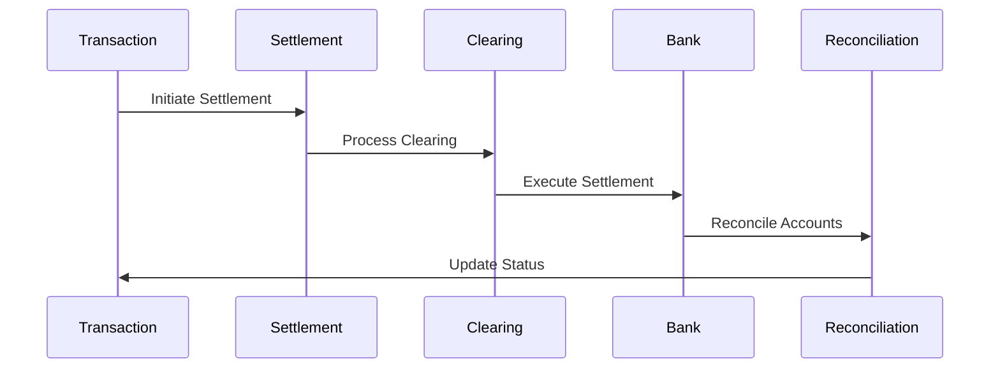
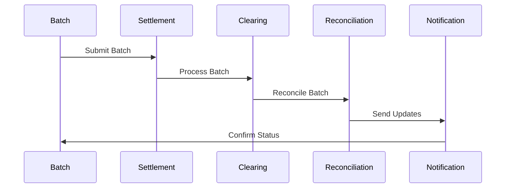

# Settlement Processes Implementation

This document covers the implementation details and technical specifications for settlement processes in fintech applications.

## Overview

Settlement processes are critical components of fintech applications, ensuring the final transfer of funds between parties and the completion of financial transactions. This document explains the core concepts, cycles, and implementation details for managing settlement processes in a fintech application.

## Core Concepts

### Settlement Types

#### 1. Payment Settlements
- **Direct Settlements**
  - Real-time settlements
  - Immediate settlements
  - Instant settlements
  - Same-day settlements

- **Batch Settlements**
  - End-of-day settlements
  - Scheduled settlements
  - Bulk settlements
  - System settlements

- **Conditional Settlements**
  - Escrow settlements
  - Hold settlements
  - Conditional releases
  - Time-based settlements

#### 2. Clearing Settlements
- **Bank Clearing**
  - Interbank settlements
  - Clearing house settlements
  - Correspondent bank settlements
  - Central bank settlements

- **Network Clearing**
  - Card network settlements
  - Payment network settlements
  - Exchange settlements
  - Platform settlements

- **Cross-Border Clearing**
  - International settlements
  - Currency settlements
  - Correspondent settlements
  - SWIFT settlements

#### 3. Special Settlements
- **Investment Settlements**
  - Securities settlements
  - Trading settlements
  - Fund settlements
  - Dividend settlements

- **Derivative Settlements**
  - Option settlements
  - Future settlements
  - Swap settlements
  - Forward settlements

- **System Settlements**
  - Interest settlements
  - Fee settlements
  - Adjustment settlements
  - Reconciliation settlements

### Settlement Cycles

#### 1. Settlement Timing
- **Real-time Settlement**
  - Instant processing
  - Immediate confirmation
  - Real-time updates
  - Live monitoring

- **Batch Settlement**
  - Daily cycles
  - Multi-day cycles
  - End-of-period
  - Scheduled cycles

- **Conditional Settlement**
  - Time-based
  - Event-based
  - Threshold-based
  - Approval-based

#### 2. Settlement States
- **Initiation**
  - Created
  - Validated
  - Authorized
  - Submitted

- **Processing**
  - In progress
  - Pending
  - Queued
  - Processing

- **Completion**
  - Completed
  - Failed
  - Reversed
  - Cancelled

### Settlement Flows

#### 1. Standard Settlement Flow


#### 2. Batch Settlement Flow


## Implementation Guidelines

### 1. Settlement Processing System

#### Settlement Management
```go
// SettlementManager handles settlement processing
type SettlementManager struct {
    processor       SettlementProcessor
    validator       SettlementValidator
    reconciler      SettlementReconciler
    reporter        SettlementReporter
}

// Settlement represents a settlement process
type Settlement struct {
    ID              string
    Type            SettlementType
    Amount          decimal.Decimal
    Currency        string
    Status          SettlementStatus
    BatchID         string
    CreatedAt       time.Time
    UpdatedAt       time.Time
}

// SettlementBatch represents a batch of settlements
type SettlementBatch struct {
    ID              string
    Type            BatchType
    Settlements     []Settlement
    Status          BatchStatus
    ProcessedAt     time.Time
}

func (sm *SettlementManager) ProcessSettlement(
    ctx context.Context,
    settlement *Settlement,
) (*SettlementResult, error) {
    // Validate settlement
    // Process settlement
    // Handle reconciliation
    // Generate reports
}
```

#### Settlement Processing
```go
// SettlementProcessor handles settlement execution
type SettlementProcessor struct {
    executor        SettlementExecutor
    validator       SettlementValidator
    monitor         SettlementMonitor
    reporter        SettlementReporter
}

// ProcessingResult represents settlement processing result
type ProcessingResult struct {
    SettlementID    string
    Status          ProcessingStatus
    Error           error
    Details         map[string]interface{}
    ProcessedAt     time.Time
}

func (sp *SettlementProcessor) ExecuteSettlement(
    ctx context.Context,
    settlement *Settlement,
) (*ProcessingResult, error) {
    // Execute settlement
    // Validate result
    // Monitor status
    // Generate report
}
```

### 2. Settlement Monitoring System

#### Settlement Monitoring
```go
// SettlementMonitor handles settlement monitoring
type SettlementMonitor struct {
    metrics         map[string]Metric
    alerts          []Alert
    analyzer        SettlementAnalyzer
    reporter        MonitorReporter
}

// SettlementMetric represents a settlement metric
type SettlementMetric struct {
    ID              string
    Type            MetricType
    Value           float64
    Threshold       float64
    Trend           []float64
    LastUpdated     time.Time
}

func (sm *SettlementMonitor) MonitorSettlement(
    ctx context.Context,
    settlement *Settlement,
) (*MonitoringResult, error) {
    // Collect metrics
    // Analyze patterns
    // Generate alerts
    // Update status
}
```

### 3. Settlement Reconciliation System

```go
// ReconciliationManager handles settlement reconciliation
type ReconciliationManager struct {
    processor       ReconciliationProcessor
    validator       ReconciliationValidator
    reporter        ReconciliationReporter
    monitor         ReconciliationMonitor
}

// Reconciliation represents a reconciliation process
type Reconciliation struct {
    ID              string
    Type            ReconciliationType
    Status          ReconciliationStatus
    Results         []ReconciliationResult
    CreatedAt       time.Time
    UpdatedAt       time.Time
}

func (rm *ReconciliationManager) ProcessReconciliation(
    ctx context.Context,
    reconciliation *Reconciliation,
) (*ReconciliationResult, error) {
    // Process reconciliation
    // Validate results
    // Generate reports
    // Monitor status
}
```

### 4. Settlement Dispute System

```go
// DisputeManager handles settlement disputes
type DisputeManager struct {
    processor       DisputeProcessor
    validator       DisputeValidator
    communicator    DisputeCommunicator
    reporter        DisputeReporter
}

// Dispute represents a settlement dispute
type Dispute struct {
    ID              string
    Type            DisputeType
    Status          DisputeStatus
    Resolution      DisputeResolution
    CreatedAt       time.Time
    UpdatedAt       time.Time
}

func (dm *DisputeManager) ProcessDispute(
    ctx context.Context,
    dispute *Dispute,
) (*DisputeResult, error) {
    // Process dispute
    // Validate resolution
    // Handle communication
    // Generate reports
}
```

## Best Practices

### 1. Settlement Processing
- Clear validation
- Proper authorization
- Secure processing
- Error handling
- Audit trails

### 2. Settlement Management
- Clear categorization
- Proper routing
- Status tracking
- Error recovery
- Documentation

### 3. Settlement Monitoring
- Real-time monitoring
- Pattern analysis
- Alert management
- Performance tracking
- Reporting

### 4. Operations
- Clear procedures
- Automation
- Monitoring
- Support
- Recovery

## Common Pitfalls

1. **Settlement Processing**
   - Validation gaps
   - Authorization issues
   - Solution: Strong controls

2. **Settlement Management**
   - Status tracking
   - Error handling
   - Solution: Robust management

3. **Settlement Monitoring**
   - Missed alerts
   - Delayed response
   - Solution: Active monitoring

4. **Operations**
   - Process gaps
   - Manual errors
   - Solution: Automation

## Monitoring and Alerts

### Key Metrics
- Settlement volume
- Processing times
- Success rates
- Error rates
- Reconciliation times

### Alerts
- Failed settlements
- Processing delays
- High error rates
- Compliance issues
- System issues

## Testing

### Unit Tests
```go
func TestSettlementProcessing(t *testing.T) {
    tests := []struct {
        name        string
        settlement  *Settlement
        want        *ProcessingResult
    }{
        {
            name: "successful settlement",
            settlement: &Settlement{
                Type:     SettlementTypeDirect,
                Amount:   decimal.NewFromFloat(1000.00),
                Currency: "USD",
            },
            want: &ProcessingResult{
                Status: ProcessingStatusCompleted,
                Error:  nil,
            },
        },
        // Add more test cases
    }
    
    for _, tt := range tests {
        t.Run(tt.name, func(t *testing.T) {
            // Test settlement processing
        })
    }
}
```

### Integration Tests
- End-to-end flows
- Settlement processing
- Batch processing
- Error handling
- Recovery procedures

## Resources

### Internal Resources
- [API Documentation](./../../api/README.md)
- [Compliance Guide](./../compliance/README.md)
- [Security Guide](./../security/README.md)

### External Resources
- [ISO 20022](https://www.iso20022.org/)
- [SWIFT Documentation](https://www.swift.com/)
- [Clearing Standards](https://www.bis.org/) 