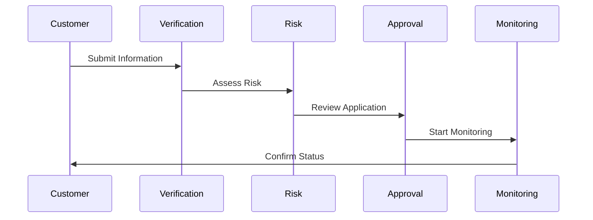
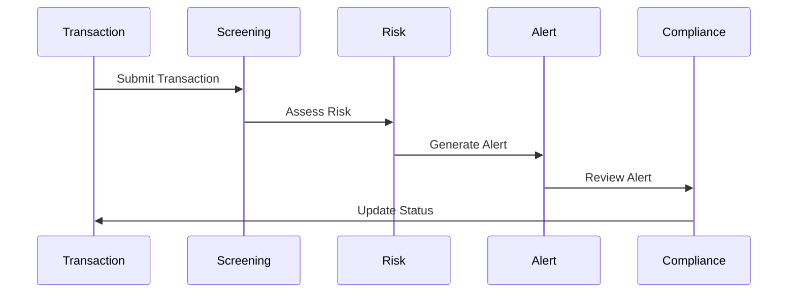

# Financial Regulations and Compliance

## Overview
Financial regulations and compliance form the legal and operational framework that governs fintech operations, ensuring compliance with laws, protecting consumers, and maintaining financial system stability. This document explains the core concepts, requirements, and implementation details for managing regulatory compliance in a fintech application.

## Core Concepts

### Regulatory Frameworks

#### 1. Banking Regulations
- **Licensing Requirements**
  - Banking licenses
  - Payment licenses
  - Money transfer licenses
  - Specialized licenses

- **Capital Requirements**
  - Minimum capital
  - Capital adequacy
  - Risk-based capital
  - Capital buffers

- **Operational Requirements**
  - Governance
  - Risk management
  - Internal controls
  - Reporting systems

#### 2. Payment Regulations
- **Payment Services**
  - Payment processing
  - Money transfers
  - Payment initiation
  - Account access

- **Security Requirements**
  - Authentication
  - Authorization
  - Encryption
  - Access control

- **Consumer Protection**
  - Transparency
  - Fair treatment
  - Dispute resolution
  - Complaint handling

#### 3. Anti-Money Laundering (AML)
- **Customer Due Diligence (CDD)**
  - Customer identification
  - Risk assessment
  - Ongoing monitoring
  - Enhanced due diligence

- **Transaction Monitoring**
  - Suspicious activity detection
  - Transaction limits
  - Pattern analysis
  - Reporting requirements

- **Record Keeping**
  - Transaction records
  - Customer information
  - Compliance reports
  - Audit trails

#### 4. Know Your Customer (KYC)
- **Identity Verification**
  - Document verification
  - Biometric checks
  - Address verification
  - Risk scoring

- **Customer Screening**
  - Sanctions lists
  - PEP screening
  - Adverse media
  - Risk categorization

- **Ongoing Monitoring**
  - Regular reviews
  - Update requirements
  - Risk reassessment
  - Compliance checks

#### 5. Data Regulations
- **Data Protection**
  - Personal data
  - Financial data
  - Transaction data
  - Sensitive data

- **Privacy Requirements**
  - Consent management
  - Data minimization
  - Purpose limitation
  - Data retention

- **Security Standards**
  - Data security
  - Access control
  - Encryption
  - Monitoring

### Compliance Operations

#### 1. Risk Management
- **Risk Assessment**
  - Risk identification
  - Risk evaluation
  - Risk mitigation
  - Risk monitoring

- **Compliance Monitoring**
  - Transaction monitoring
  - Activity monitoring
  - Risk monitoring
  - Performance monitoring

- **Reporting Systems**
  - Regulatory reporting
  - Internal reporting
  - External reporting
  - Audit reporting

#### 2. Compliance Processes
- **Customer Due Diligence**
  - KYC processes
  - Customer verification
  - Risk assessment
  - Ongoing monitoring

- **Transaction Monitoring**
  - Transaction screening
  - Pattern analysis
  - Risk scoring
  - Alert management

- **Reporting Obligations**
  - Regulatory reports
  - Transaction reports
  - Suspicious activity
  - Compliance reports

### Compliance Flows

#### 1. Customer Onboarding Flow


#### 2. Transaction Monitoring Flow


## Implementation Guidelines

### 1. Compliance Management System

#### Compliance Management
```go
// ComplianceManager handles regulatory compliance
type ComplianceManager struct {
    validator       ComplianceValidator
    monitor         ComplianceMonitor
    reporter        ComplianceReporter
    auditor         ComplianceAuditor
}

// ComplianceCheck represents a compliance check
type ComplianceCheck struct {
    ID              string
    Type            CheckType
    Status          CheckStatus
    Risk            RiskLevel
    Details         map[string]interface{}
    CreatedAt       time.Time
    UpdatedAt       time.Time
}

// ComplianceReport represents a compliance report
type ComplianceReport struct {
    ID              string
    Type            ReportType
    Period          time.Time
    Findings        []Finding
    Status          ReportStatus
    GeneratedAt     time.Time
}

func (cm *ComplianceManager) ProcessCompliance(
    ctx context.Context,
    check *ComplianceCheck,
) (*ComplianceResult, error) {
    // Validate compliance
    // Monitor status
    // Generate reports
    // Audit process
}
```

#### Risk Assessment
```go
// RiskManager handles risk assessment
type RiskManager struct {
    assessor        RiskAssessor
    validator       RiskValidator
    monitor         RiskMonitor
    reporter        RiskReporter
}

// RiskAssessment represents a risk assessment
type RiskAssessment struct {
    ID              string
    Type            AssessmentType
    Score           float64
    Level           RiskLevel
    Factors         []RiskFactor
    CreatedAt       time.Time
}

func (rm *RiskManager) AssessRisk(
    ctx context.Context,
    assessment *RiskAssessment,
) (*AssessmentResult, error) {
    // Assess risk
    // Validate assessment
    // Monitor changes
    // Generate report
}
```

#### Compliance Monitoring
```go
// ComplianceMonitor handles compliance monitoring
type ComplianceMonitor struct {
    metrics         map[string]Metric
    alerts          []Alert
    analyzer        ComplianceAnalyzer
    reporter        MonitorReporter
}

// ComplianceMetric represents a compliance metric
type ComplianceMetric struct {
    ID              string
    Type            MetricType
    Value           float64
    Threshold       float64
    Trend           []float64
    LastUpdated     time.Time
}

func (cm *ComplianceMonitor) MonitorCompliance(
    ctx context.Context,
    check *ComplianceCheck,
) (*MonitoringResult, error) {
    // Collect metrics
    // Analyze patterns
    // Generate alerts
    // Update status
}
```

### 2. Reporting System

#### Report Generation
```go
// ReportGenerator handles compliance reporting
type ReportGenerator struct {
    templates       map[string]ReportTemplate
    dataSources     []DataSource
    validators      []ReportValidator
}

// Report represents a compliance report
type Report struct {
    ID              string
    Type            ReportType
    Period          time.Time
    Data            map[string]interface{}
    Status          ReportStatus
    GeneratedAt     time.Time
    SubmittedAt     time.Time
}

func (rg *ReportGenerator) GenerateReport(
    ctx context.Context,
    reportType ReportType,
    period time.Time,
) (*Report, error) {
    // Collect report data
    // Apply templates
    // Validate report
    // Generate final report
}
```

### 3. Audit System

#### Audit Logging
```go
// AuditLogger handles compliance auditing
type AuditLogger struct {
    storage         AuditStorage
    formatters      []LogFormatter
    validators      []LogValidator
}

// AuditLog represents a compliance audit log
type AuditLog struct {
    ID              string
    Action          string
    Actor           string
    Target          string
    Changes         map[string]interface{}
    Metadata        map[string]interface{}
    Timestamp       time.Time
}
```

## Best Practices

### Compliance Management
- Clear compliance policies
- Regular risk assessments
- Comprehensive monitoring
- Detailed reporting
- Proper documentation
- Regular audits
- Staff training

### Risk Management
- Risk-based approach
- Regular assessments
- Clear risk policies
- Proper monitoring
- Effective controls
- Regular reviews
- Staff training

### Regulatory Reporting
- Accurate reporting
- Timely submission
- Proper documentation
- Regular reviews
- Clear processes
- Staff training
- Quality checks

### Operations
- Clear procedures
- Regular monitoring
- Proper documentation
- Staff training
- Quality assurance
- Regular reviews
- Continuous improvement

## Common Pitfalls

### Compliance Management
- Incomplete policies
- Inadequate monitoring
- Poor documentation
- Insufficient training
- Weak controls
- Late reporting
- Poor audits

### Risk Management
- Inadequate assessment
- Poor monitoring
- Weak controls
- Insufficient training
- Late reporting
- Poor documentation
- Ineffective reviews

### Regulatory Reporting
- Late submission
- Inaccurate data
- Poor documentation
- Insufficient review
- Weak processes
- Poor training
- Inadequate checks

### Operations
- Unclear procedures
- Poor monitoring
- Weak documentation
- Insufficient training
- Poor quality
- Inadequate reviews
- No improvement

## Monitoring and Alerts

### Key Metrics
- Compliance rates
- Risk levels
- Report status
- Audit status
- Training status
- Control effectiveness
- Incident rates

### Alerts
- Compliance violations
- Risk threshold breaches
- Report deadlines
- Audit findings
- Training requirements
- Control failures
- Incident reports

## Testing Strategies

### Unit Tests
- Compliance checks
- Risk assessments
- Report generation
- Audit logging
- Policy validation
- Process validation
- Control testing

### Integration Tests
- End-to-end compliance
- Risk assessment flow
- Report generation flow
- Audit logging flow
- Policy implementation
- Process execution
- Control operation

## Resources

### Internal Resources
- Compliance Documentation
- Risk Assessment Guides
- Reporting Guidelines
- Audit Guidelines
- Training Materials
- Policy Documents
- Process Documents

### External Resources
- Regulatory Standards
- Industry Guidelines
- Best Practices
- Training Resources
- Compliance Tools
- Risk Tools
- Audit Tools 