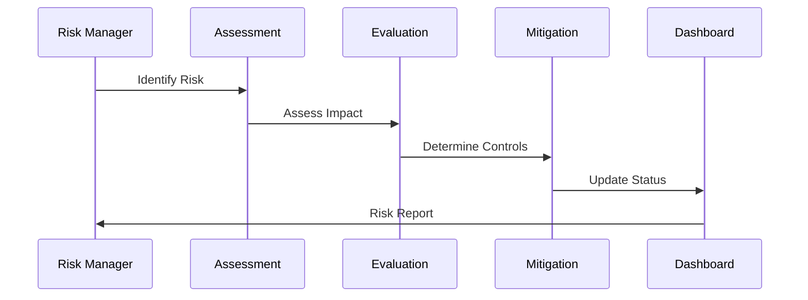
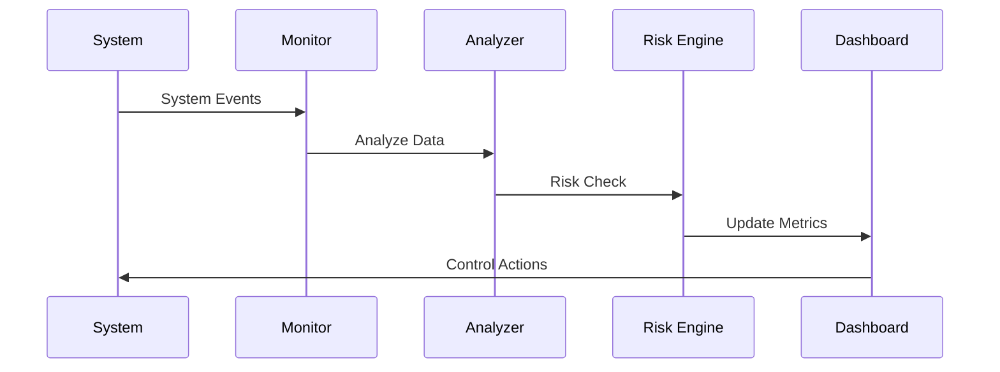

# Risk Management Implementation

This document covers the implementation details and technical specifications for risk management in fintech applications.

## Overview

Risk management is a critical component of fintech operations, ensuring the identification, assessment, and mitigation of various risks that could impact the business, customers, and operations. This document explains the core concepts, processes, and considerations for implementing effective risk management in a fintech application.

## Core Concepts

### Risk Categories

#### 1. Operational Risk
- **System Risks**
  - System failures
  - Performance issues
  - Data integrity
  - Service availability

- **Process Risks**
  - Process failures
  - Human error
  - Control weaknesses
  - Documentation gaps

- **External Risks**
  - Third-party failures
  - Market conditions
  - Regulatory changes
  - Natural disasters

#### 2. Financial Risk
- **Credit Risk**
  - Default risk
  - Counterparty risk
  - Portfolio risk
  - Concentration risk

- **Market Risk**
  - Interest rate risk
  - Currency risk
  - Liquidity risk
  - Price risk

- **Liquidity Risk**
  - Funding risk
  - Cash flow risk
  - Asset liquidity
  - Market liquidity

#### 3. Compliance Risk
- **Regulatory Risk**
  - Non-compliance
  - Regulatory changes
  - Reporting failures
  - License risk

- **Legal Risk**
  - Contract risk
  - Litigation risk
  - Documentation risk
  - Intellectual property

- **Reputational Risk**
  - Customer trust
  - Brand damage
  - Public perception
  - Social media impact

### Risk Management Process

#### 1. Risk Identification
- Risk assessment
- Risk categorization
- Risk documentation
- Risk ownership

#### 2. Risk Assessment
- Impact analysis
- Probability assessment
- Risk scoring
- Risk prioritization

#### 3. Risk Mitigation
- Control implementation
- Risk monitoring
- Risk reporting
- Risk review

### Risk Management Flows

#### 1. Risk Assessment Flow


#### 2. Risk Monitoring Flow


## Implementation Guidelines

### 1. Risk Management System

#### Risk Assessment
```go
// RiskAssessment handles risk evaluation
type RiskAssessment struct {
    riskEngine      RiskEngine
    controlManager  ControlManager
    monitorManager  MonitorManager
    reportGenerator ReportGenerator
}

// Risk represents a risk item
type Risk struct {
    ID              string
    Category        RiskCategory
    Type            RiskType
    Description     string
    Impact          RiskImpact
    Probability     RiskProbability
    Score           float64
    Controls        []Control
    Status          RiskStatus
    CreatedAt       time.Time
    UpdatedAt       time.Time
}

// Control represents a risk control
type Control struct {
    ID              string
    Type            ControlType
    Description     string
    Effectiveness   float64
    Status          ControlStatus
    Metrics         map[string]float64
    LastReview      time.Time
}

func (ra *RiskAssessment) AssessRisk(
    ctx context.Context,
    risk *Risk,
) (*RiskAssessment, error) {
    // Evaluate impact
    // Calculate probability
    // Determine score
    // Identify controls
    // Generate assessment
}
```

#### Risk Monitoring
```go
// RiskMonitor handles risk monitoring
type RiskMonitor struct {
    metrics         map[string]Metric
    thresholds      map[string]Threshold
    alertManager    AlertManager
    reportManager   ReportManager
}

// Metric represents a risk metric
type Metric struct {
    ID              string
    Name            string
    Type            MetricType
    Value           float64
    Threshold       float64
    Trend           []float64
    LastUpdated     time.Time
}

func (rm *RiskMonitor) MonitorRisk(
    ctx context.Context,
    risk *Risk,
) (*MonitoringResult, error) {
    // Collect metrics
    // Check thresholds
    // Analyze trends
    // Generate alerts
    // Update status
}

// MonitoringResult represents risk monitoring results
type MonitoringResult struct {
    RiskID          string
    Metrics         map[string]Metric
    Alerts          []Alert
    Status          MonitoringStatus
    Recommendations []string
    Timestamp       time.Time
}
```

### 2. Risk Reporting System

#### Report Generation
```go
// RiskReporter handles risk reporting
type RiskReporter struct {
    templates       map[string]ReportTemplate
    dataCollector   DataCollector
    formatter       ReportFormatter
    distributor     ReportDistributor
}

// Report represents a risk report
type Report struct {
    ID              string
    Type            ReportType
    Period          time.Time
    Risks           []Risk
    Metrics         map[string]Metric
    Status          ReportStatus
    GeneratedAt     time.Time
    DistributedAt   time.Time
}

func (rr *RiskReporter) GenerateReport(
    ctx context.Context,
    reportType ReportType,
    period time.Time,
) (*Report, error) {
    // Collect risk data
    // Calculate metrics
    // Format report
    // Distribute report
}
```

### 3. Risk Control System

#### Control Management
```go
// ControlManager handles risk controls
type ControlManager struct {
    controls        map[string]Control
    evaluator       ControlEvaluator
    implementer     ControlImplementer
    monitor         ControlMonitor
}

// ControlEvaluation represents a control assessment
type ControlEvaluation struct {
    ControlID       string
    Effectiveness   float64
    Gaps            []string
    Recommendations []string
    Status          EvaluationStatus
    EvaluatedAt     time.Time
}

func (cm *ControlManager) EvaluateControl(
    ctx context.Context,
    control *Control,
) (*ControlEvaluation, error) {
    // Assess effectiveness
    // Identify gaps
    // Make recommendations
    // Update status
}
```

## Best Practices

### 1. Risk Assessment
- Regular risk reviews
- Comprehensive assessment
- Clear documentation
- Stakeholder involvement
- Continuous monitoring

### 2. Risk Monitoring
- Real-time monitoring
- Automated alerts
- Trend analysis
- Regular reporting
- Action tracking

### 3. Risk Controls
- Effective controls
- Regular testing
- Control updates
- Documentation
- Performance monitoring

### 4. Risk Reporting
- Clear reporting
- Regular updates
- Actionable insights
- Stakeholder communication
- Audit trails

## Common Pitfalls

1. **Risk Assessment**
   - Incomplete assessment
   - Outdated risks
   - Solution: Regular comprehensive reviews

2. **Risk Monitoring**
   - Missed risks
   - Delayed response
   - Solution: Automated monitoring and alerts

3. **Risk Controls**
   - Ineffective controls
   - Control gaps
   - Solution: Regular control evaluation

4. **Risk Reporting**
   - Incomplete reports
   - Late reporting
   - Solution: Automated reporting system

## Monitoring and Alerts

### Key Metrics
- Risk scores
- Control effectiveness
- Incident rates
- Response times
- Mitigation progress

### Alerts
- Risk threshold breaches
- Control failures
- Incident detection
- Compliance issues
- System issues

## Testing

### Unit Tests
```go
func TestRiskAssessment(t *testing.T) {
    tests := []struct {
        name    string
        risk    *Risk
        want    *RiskAssessment
    }{
        {
            name: "high-impact operational risk",
            risk: &Risk{
                Category:    RiskCategoryOperational,
                Type:       RiskTypeSystem,
                Impact:     RiskImpactHigh,
                Probability: RiskProbabilityMedium,
            },
            want: &RiskAssessment{
                Score: 0.75,
                Status: RiskStatusActive,
            },
        },
        // Add more test cases
    }
    
    for _, tt := range tests {
        t.Run(tt.name, func(t *testing.T) {
            // Test risk assessment
        })
    }
}
```

### Integration Tests
- End-to-end risk flows
- Risk assessment
- Control evaluation
- Monitoring system
- Reporting system

## Resources

### Internal Resources
- [API Documentation](./../../api/README.md)
- [Compliance Guide](./../compliance/README.md)
- [Security Guide](./../security/README.md)

### External Resources
- [COSO Framework](https://www.coso.org/)
- [ISO 31000](https://www.iso.org/iso-31000-risk-management.html)
- [Basel Committee](https://www.bis.org/bcbs/) 