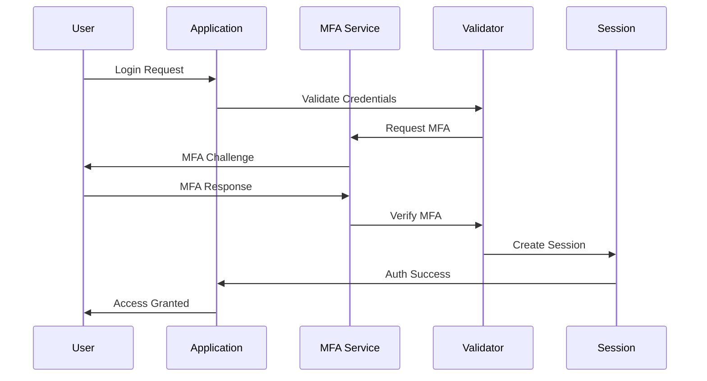
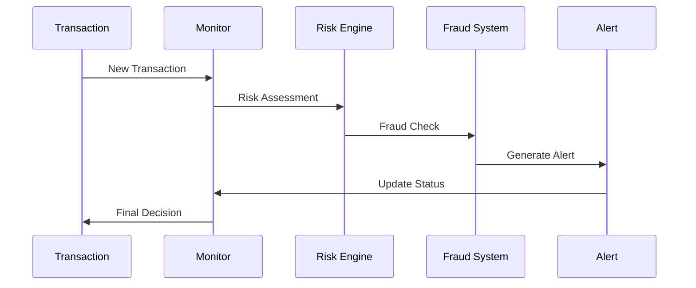

# Security and Fraud Prevention Implementation

This document covers the implementation details and technical specifications for security and fraud prevention in fintech applications.

## Overview

Security and fraud prevention are critical components of any fintech application, ensuring the protection of user data, financial assets, and system integrity. This document explains the core concepts, measures, and considerations for implementing robust security and fraud prevention in a fintech application.

## Core Concepts

### Security Measures

#### 1. Authentication & Authorization
- **Multi-Factor Authentication (MFA)**
  - Something you know (password)
  - Something you have (device)
  - Something you are (biometrics)
  - Risk-based authentication

- **Access Control**
  - Role-based access (RBAC)
  - Attribute-based access (ABAC)
  - Least privilege principle
  - Session management

- **Identity Management**
  - User provisioning
  - Password policies
  - Account recovery
  - Session handling

#### 2. Data Security
- **Encryption**
  - Data at rest
  - Data in transit
  - Key management
  - Certificate management

- **Data Protection**
  - Tokenization
  - Masking
  - Sanitization
  - Secure storage

- **Secure Communication**
  - TLS/SSL
  - API security
  - Network security
  - Secure protocols

#### 3. Application Security
- **Input Validation**
  - Data sanitization
  - Parameter validation
  - Content validation
  - Format checking

- **Security Headers**
  - CSP
  - HSTS
  - XSS protection
  - CSRF protection

- **Secure Coding**
  - Code review
  - Static analysis
  - Dynamic analysis
  - Dependency scanning

### Fraud Prevention

#### 1. Transaction Monitoring
- **Real-time Monitoring**
  - Amount thresholds
  - Velocity checks
  - Pattern analysis
  - Location-based rules

- **Behavioral Analysis**
  - User behavior
  - Device fingerprinting
  - Location patterns
  - Time patterns

- **Risk Scoring**
  - Transaction risk
  - User risk
  - Device risk
  - Location risk

#### 2. Fraud Detection
- **Rule-based Detection**
  - Transaction rules
  - User rules
  - Device rules
  - Location rules

- **Machine Learning**
  - Anomaly detection
  - Pattern recognition
  - Predictive analytics
  - Risk modeling

- **Manual Review**
  - Case management
  - Investigation
  - Decision making
  - Documentation

### Security Flows

#### 1. Authentication Flow


#### 2. Fraud Detection Flow


## Implementation Guidelines

### 1. Security System

#### Authentication
```go
// Authenticator handles user authentication
type Authenticator struct {
    passwordHasher  PasswordHasher
    mfaProvider     MFAProvider
    sessionManager  SessionManager
    rateLimiter     RateLimiter
}

// AuthRequest represents an authentication request
type AuthRequest struct {
    Username        string
    Password        string
    DeviceID        string
    IPAddress       string
    Metadata        map[string]interface{}
}

func (a *Authenticator) Authenticate(
    ctx context.Context,
    req *AuthRequest,
) (*AuthResponse, error) {
    // Validate credentials
    // Check rate limits
    // Verify MFA
    // Create session
    // Return response
}

// AuthResponse represents an authentication response
type AuthResponse struct {
    Token           string
    ExpiresAt       time.Time
    MFARequired     bool
    RiskScore       float64
    SessionID       string
}
```

#### Authorization
```go
// Authorizer handles access control
type Authorizer struct {
    roleManager     RoleManager
    policyEngine    PolicyEngine
    permissionCache Cache
}

// AccessRequest represents an authorization request
type AccessRequest struct {
    UserID          string
    Resource        string
    Action          string
    Context         map[string]interface{}
}

func (a *Authorizer) Authorize(
    ctx context.Context,
    req *AccessRequest,
) (bool, error) {
    // Check permissions
    // Evaluate policies
    // Apply context
    // Return decision
}
```

### 2. Fraud Prevention System

#### Transaction Monitoring
```go
// TransactionMonitor handles fraud monitoring
type TransactionMonitor struct {
    rules           []FraudRule
    mlModel         MLModel
    riskEngine      RiskEngine
    alertManager    AlertManager
}

// FraudRule represents a fraud detection rule
type FraudRule struct {
    ID              string
    Type            RuleType
    Conditions      []Condition
    Actions         []Action
    Priority        int
    Status          RuleStatus
}

func (tm *TransactionMonitor) MonitorTransaction(
    ctx context.Context,
    tx *Transaction,
) (*FraudDecision, error) {
    // Apply rules
    // Run ML model
    // Calculate risk
    // Make decision
}

// FraudDecision represents a fraud detection decision
type FraudDecision struct {
    TransactionID   string
    RiskScore       float64
    Decision        DecisionType
    Reasons         []string
    Actions         []Action
    Timestamp       time.Time
}
```

### 3. Security Monitoring

#### Security Monitoring
```go
// SecurityMonitor handles security monitoring
type SecurityMonitor struct {
    logCollector    LogCollector
    alertManager    AlertManager
    incidentManager IncidentManager
}

// SecurityEvent represents a security event
type SecurityEvent struct {
    ID              string
    Type            EventType
    Severity        EventSeverity
    Source          string
    Details         map[string]interface{}
    Timestamp       time.Time
}

func (sm *SecurityMonitor) MonitorSecurity(
    ctx context.Context,
    event *SecurityEvent,
) error {
    // Collect logs
    // Analyze event
    // Generate alerts
    // Handle incident
}
```

## Best Practices

### 1. Authentication & Authorization
- Implement strong password policies
- Use MFA where appropriate
- Implement proper session management
- Regular access reviews
- Secure password recovery

### 2. Data Security
- Encrypt sensitive data
- Implement proper key management
- Use secure protocols
- Regular security audits
- Data classification

### 3. Fraud Prevention
- Real-time monitoring
- Regular rule updates
- ML model training
- Manual review process
- Incident response

### 4. Security Operations
- Regular security testing
- Vulnerability management
- Incident response
- Security training
- Compliance monitoring

## Common Pitfalls

1. **Authentication**
   - Weak passwords
   - Missing MFA
   - Solution: Implement strong authentication

2. **Data Protection**
   - Insufficient encryption
   - Poor key management
   - Solution: Proper encryption and key management

3. **Fraud Detection**
   - False positives
   - Missed fraud
   - Solution: Regular rule tuning and ML model updates

4. **Security Monitoring**
   - Alert fatigue
   - Missed incidents
   - Solution: Proper alert management and response

## Monitoring and Alerts

### Key Metrics
- Authentication success rate
- Fraud detection rate
- Security incident rate
- Response times
- System health

### Alerts
- Failed authentication
- Suspicious activity
- Security incidents
- System issues
- Compliance violations

## Testing

### Unit Tests
```go
func TestSecurityMonitoring(t *testing.T) {
    tests := []struct {
        name    string
        event   *SecurityEvent
        want    error
    }{
        {
            name: "suspicious login attempt",
            event: &SecurityEvent{
                Type:     EventTypeLoginAttempt,
                Severity: EventSeverityHigh,
                Source:   "192.168.1.1",
                Details: map[string]interface{}{
                    "username": "testuser",
                    "attempts": 5,
                },
            },
            want: nil,
        },
        // Add more test cases
    }
    
    for _, tt := range tests {
        t.Run(tt.name, func(t *testing.T) {
            // Test security monitoring
        })
    }
}
```

### Integration Tests
- End-to-end security flows
- Authentication flows
- Authorization checks
- Fraud detection
- Incident response

## Resources

### Internal Resources
- [API Documentation](./../../api/README.md)
- [Compliance Guide](./../compliance/README.md)
- [Risk Management Guide](./../risk/README.md)

### External Resources
- [OWASP Guidelines](https://owasp.org/)
- [NIST Guidelines](https://www.nist.gov/)
- [PCI DSS Standards](https://www.pcisecuritystandards.org/) 